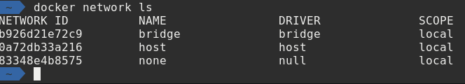

# Test Repositiory

---

## Andrew Pruski

### SQL Server DBA, Microsoft Data Platform MVP, & Certified Kubernetes Administrator

<a href="https://twitter.com/dbafromthecold">@dbafromthecold</a> 
www.dbafromthecold.com 
<a href="https://github.com/dbafromthecold">github.com/dbafromthecold.com</a>

---

## Image example

---

## Code example

---?code=assets/code/docker_container_run.sh&lang=bash&title=Running a Container